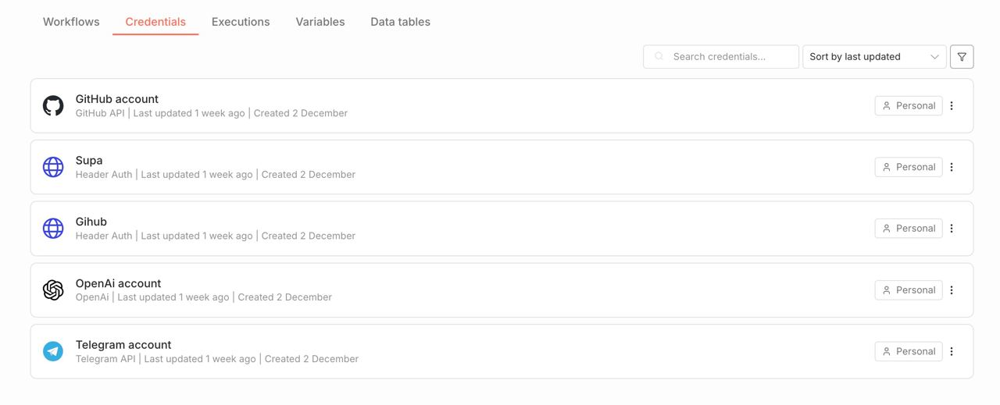

# 🚀 The AI Delivery Pipeline: Setup Guide

---

# Automatic ChatOps solution to deploy your no-code/low-code app

Welcome! This guide will turn your no-code generated application to a stable solution using n8n as a professional deployment manager for your AI apps. By the end, you'll be able to deploy your Lovable app to production just by chatting with your Telegram bot.

You built an app with Lovable, but "vibe coding" is only half the battle. To run a real business, you need a professional way to deliver updates without breaking your live site.

**This pipeline turns your Lovable project into a production-grade software application.**

- **🛡️ Stop Breaking Production:** Your changes land on a "Test Site" first. This pipeline only moves them to your "Live Site" when you approve.
- **🧠 AI-Powered Release Notes:** No more guessing "what changed?" Our AI reads your code and writes a clear, non-technical summary for you and your stakeholders.
- **📱 Your Chat is Your Cockpit:** Forget logging into Vercel, GitHub, or Supabase. Check security, review changes, and deploy updates directly from Telegram.
    
    No passwords to remember!
    
- **⚡ One-Command Delivery:** Type `/start`, review the AI summary, and click a button. You just saved 3 hours of DevOps work.

## **How It Works**

1. **You Code:** You make changes in Lovable and it automatically synced with GitHub repository (this updates your **Test** site).
2. **You Chat:** You open Telegram and type `/start`.
3. **The Bot Thinks:**
    - It checks if your database is secure (RLS Check).
    - It compares your **Test** site vs. **Live** site.
    - It uses GPT-4o to write a summary of the changes.
4. **You Decide:** The bot sends you a report. You click **[ 🚀 Deploy ]**.
5. **It Ships:** The pipeline merges the code, and Vercel automatically builds your new Live version.

---

## **Phase 1: Pre-Requisites**

*Before connecting the pipeline, ensure your stack is ready.*

1. **Lovable Project:** Connected to GitHub (check which repo opens after click on “cat” Github icon in Lovable).
2. **GitHub Repository:** Must have two branches:
    - `main` (This is your **Test/Preview** environment).
    - `production` (This is your **Live** environment).
3. **Vercel:** Your live site domain should be connected to the `production` branch.
4. **Create the Security Guard (Crucial Step):**
- We need to teach your database how to report security risks to the bot.
- Open your Lovable project and paste this **exact prompt** into the chat:

> "I need to check for security vulnerabilities via API. Please create a new Supabase Edge Function named check-rls-status. This function should query the pg_class system tables to find any tables in the public schema where Row Level Security (RLS) is disabled. Return a JSON response: if safe, return { "status": "safe" }; if unsafe, return { "status": "danger", "vulnerable_tables": [...] }."
> 
- Wait for Lovable to confirm the function is deployed.
1. **Get Your Keys & Links:**
- **Anon Key:** Ask Lovable Chat: *"What is my Project Anon Key?"* (Copy the key starting with `ey...`).
- **Project URL:** Ask Lovable Chat: *"What is my Supabase Project URL?"* (It looks like `https://xyz.supabase.co`).

### Here’s instruction of how to setup branches on Github and hosting on Vercel

**Step 1: Create the Production Branch**
1. Log in to **GitHub** and open your Lovable repository.
2. Click the button that says **"main"** (top left of the file list).
3. Type `production` in the text box.
4. Click **"Create branch: production from main"**.
    ◦ *Why?* This creates an exact copy of your app that we will keep safe and separate from your daily experiments.
****

**Step 2: Configure Vercel**
1. Log in to **Vercel** and select your project.
2. Go to **Settings** $\rightarrow$ **Git**.
3. Scroll to **"Production Branch"**.
4. Click **Edit** and change it from `main` to `production`.
5. Click **Save**.
    ◦ *Note: Your next deploy to the 'production' branch will now be the one that updates your live domain.*

---

## **Phase 2: Set Up n8n Cloud**

*We use n8n Cloud because it is secure, always online, and runs your "DevOps Team" for ~$20/mo.*

1. Go to [**n8n.io**](https://n8n.io/) and sign up for the **Starter Plan**.
2. Once logged in, you will see an empty "Workflow" canvas.
3. **Import the Pipeline:**
    - Download the  file included in this kit.
    
    [AI_Delivery_Pipeline.json](attachment:d7f5cdec-c0d9-4dff-9219-5e2897ae5358:AI_Delivery_Pipeline.json)
    
    - In n8n, click the **three dots (...)** in the top right corner.
    - Click **Import from File** and select the file.
    - *Result:* The full automation chart will appear on your screen.

---

## **Phase 3: The Key Ring 🔑**

*Your bot needs permission to talk to your tools. We will create 4 keys.*

In n8n, on Home page click the **"Credentials"** tab next to Workflows. 

Create these four new credentials:

**1. Telegram (The Remote Control)**
• **Search Type:** `Telegram API`
• **Name:** `Telegram account`
• **How to get the Token:** Open Telegram App → Search `@BotFather` → Send `/newbot`. Copy the Token he gives you.
****

**2. OpenAI (The Intelligence)**
• **Search Type:** `OpenAI API`
• **Name:** `OpenAi account`
• **How to get the Key:** Log in to [OpenAI Platform](https://platform.openai.com/api-keys) → API Keys → Create New Secret Key.
****

**3. GitHub (The Code)**
• **Search Type:** `GitHub API` (Predefined)
• **Name:** `GitHub account`
• **How to get the Token:**
    ◦ Go to GitHub Settings → Developer Settings → Personal Access Tokens → **Tokens (classic)**.
    ◦ Click **Generate new token (classic)**.
    ◦ **Scopes:** Check the `repo` box (This allows the bot to merge code).
    ◦ **User:** Your GitHub username.
    ◦ **Access Token:** The `ghp_...` string you just generated.
****

**4. Supabase (The Security Guard)**
• **Search Type:** `Header Auth`
• **Name:** `Header Auth account`
• **Configuration:**
    ◦ **Name:** `Authorization`
    ◦ **Value:** Paste your **Anon Key** directly here.

---

## **Phase 4: Customise the Flow**

*Now we point the map to YOUR project.*

Go back to the Workflow canvas. 

### **⚠️ Important Note: connecting Your Keys**

When you import the workflow, you might see nodes with **red warning signs**. This is normal!

It happens because my template looks for credentials named `"Telegram account"` or `"OpenAi account"`, but you might have named yours `"My Telegram"` or `"Test Bot"`.

**How to fix it in 2 seconds:**

1. Double-click any node with a red warning.
2. Look for the **"Credential"** dropdown field.
3. Simply select **your** specific credential from the list.
4. The warning will disappear immediately.

And then edit all other Nodes (double-click these specific nodes to update them):

**1. Update Repository Links**
Locate the nodes named **"GitHub Diff"** and **"HTTP Request"** on the canvas. Double-click them.
• **URL Field:** You will see a placeholder link.
• **Action:** Replace `YOUR_USERNAME` and `YOUR_REPO_NAME` with your actual GitHub details.
    ◦ *Example:* `.../repos/elonmusk/mars-mission/compare...`
• *Important:* Keep the end of the URL (`/compare...` or `/merges`) exactly as it is.
****

**2. Update Database Link**
Locate the node named **"Check RLS"**.
• **Action:** Paste your **Supabase Project URL** into the URL field.
The URL should be your endpoint to check RLS status, example: https://your_project.supabase.co/functions/v1/check-rls-status
****

**3. Set Your Chat ID**
The bot is private; it only obeys you.
1. Open Telegram and search for `@userinfobot`. Click Start. It will send you a number (your ID).
2. In n8n, locate the **Telegram Nodes** (the blue ones like "Mess to Deploy", "Success!").
3. Double-click **EACH** Telegram node.
4. **Chat ID Field:** Paste your specific ID number.
****

**4. Connect the Bot**
1. Double-click the **Telegram Trigger** node (the very first one).
2. Click **Webhook URLs** → **Production URL** → **Copy**.
3. Paste this link into your browser address bar to register it: https://api.telegram.org/bot<YOUR_TELEGRAM_TOKEN>/setWebhook?url=<YOUR_COPIED_URL>
4. Hit Enter. You should see a success message (`"ok": true`).

---

## **Phase 5: Launch! 🚀**

1. **Activate:** Click the **Active Switch** (top right) to turn it **Green**.
2. **Test:** Open your Telegram bot.
3. **Command:** Type `/start`.
4. **Result:** You will see your deployment menu appear, complete with AI-written release notes for your latest changes.

**Congratulations!** You now have a professional deployment pipeline.

---

### **Troubleshooting**

- **"404 Not Found" on GitHub:** Check that you updated the URL with *your* username and repo, and that your Token has `repo` permissions.
- **Buttons don't work:** Toggle the **Active Switch** OFF and then ON again to refresh the connection.
